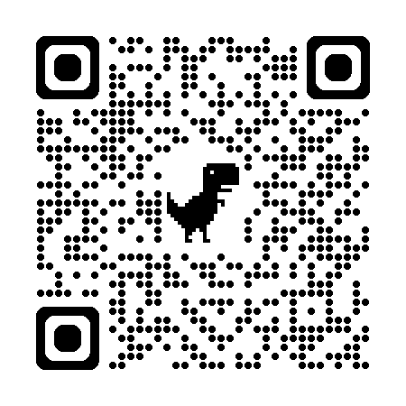

<!-- GitHub Profile README with Anime + Lofi + QR + Clean Markdown Aesthetic -->

  

<h1 align="center">👋 Hello World, I’m Arnav</h1>
<h3 align="center">🧠 Code Technician · 🎴 Anime Soul · 🌌 Midnight Creator</h3>

🖤 Calm mind. Clean code. Lofi beats in the background.  
💡 I see logic the way an animator sees storyboards — frame by frame, meaningful.  
📟 Building things that feel like comfort and work like clockwork.

---

## 🛠️ My Code Powers

- 🔧 **Code Artisan**: `Python`, `Java`, `Android`, `Flask`
- 🎨 **UI Whisperer**: `XML`, `Dark Mode`, `Lo-fi Vibes`, `Emotionally Aware Design`
- 💾 **Human-Core Dev**: `Intelligent Systems`, `Memory Logic`, `Context Awareness`
- 💬 **Languages**: English · Hindi · JavaScript · Anime 🧋

---

## 🌸 Anime That Coded My Soul

| 💥 Shonen Fire     | 🌊 Emotional Slice   | 🌠 Aesthetic Magic        |
|--------------------|----------------------|----------------------------|
| Naruto             | A Silent Voice       | Your Name (Kimi no Na Wa) |
| Demon Slayer       | 5cm Per Second       | Weathering with You       |

---

## 🧋 My Life in Emojis

🧠🎴💻🌙🎧🍵⌨️🎇🌀🌸

---

## 📫 Let's Connect

- 💼 [LinkedIn](https://www.linkedin.com/in/broken-leaf/)
- 🐦 [X / Twitter](https://x.com/broken_madara)
- 💻 [GitHub](https://github.com/Broken-Leaf)
- 🌐 [Website](https://brokenleaf.carrd.co)

---

  
   
  <i>The face behind the code — built different.🎭</i>

